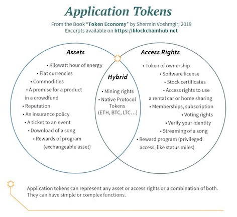
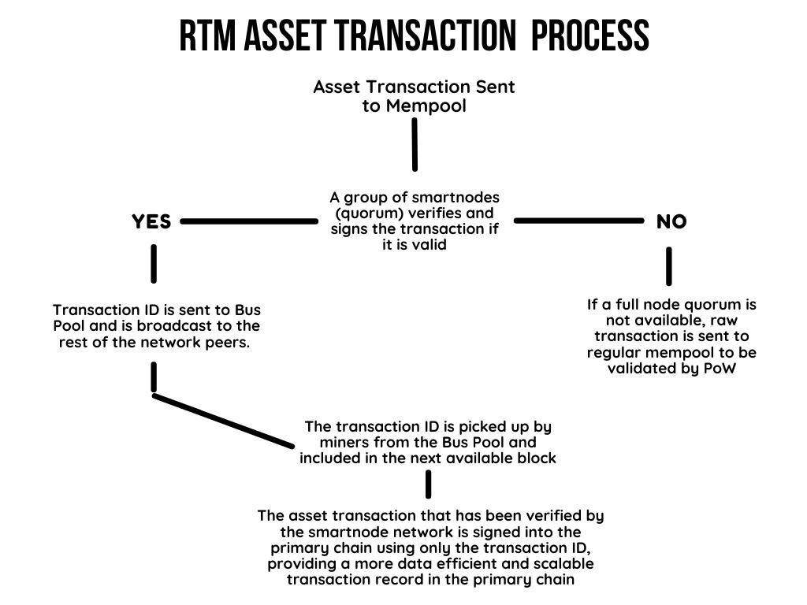

# Asset transaction scalability & usability solutions

<a class="button button--sm button--primary button--download" style={{margin: 0 + 0 + 0 + "auto"}} href="/public/whitepapers/Raptoreum_Assets_Whitepaper.pdf" target="_parent" download>Raptoreum_Assets_Whitepaper.pdf</a>

## Preface

### Problem

Current asset platforms have seen problems arise as cryptocurrency adoption has expanded, particularly when it comes to specialized applications beyond general value-based fungible tokens and unique proof of ownership NFT tokens. This problem is partially rooted inone major issue faced by Ethereum and other asset platforms: scalability. Problems with scalability of combined total asset usage, especially when it comes to on-chain transactions, has increasingly led to issues such as expensive transaction fees and slowed down average transaction confirmation times for the entire network. ETH assets are not dealt with at the protocol later, causing a data bottleneck during the rest of the process. Smart Contracts and dApps that rely on asset transactions have been met with this issue, along with the added problem of the cost of creating a transaction to send an asset being greater than the total value of the asset itself. Oftentimes, the average user now has to pay significantly higher transaction fees to create and use on-chain assets than they would have paid in the past to perform the same type of specialized asset transactions today.

### Solution

Taking new approaches to improve the creation process, the utilization process, and affordability when it comes to asset tokens will help to improve the utilization rates of asset-based blockchain technology around the world. Raptoreum (RTM) seeks to combine the ability to write smart contracts in common programming languages with a secondary validation method through the use of smartnode quorums to produce greater transaction scalability and long term affordability when it comes to the asset tokens and smart contract transactions created on the RTM network. The smartnode network can provide a platform for asset transactions as a primary alternative to utilizing the base blockchain for the entire raw transaction process. In regards to affordability, “Fees will be adjustable without the need for forking and can be done in tune with market conditions, meaning we will never be in the situation of being too expensive to use, which is critical since we want to see real adoption [(1)][].”

## Blockchain-based assets

### Concept

The concept of utilizing internal transactions (eg: transactions that take place within a smart contract), which are often triggered by external ones (eg:
standard blockchain transactions), was first popularized by Ethereum. This technique allows for smart contracts to create new assets upon the Ethereum blockchain network.

“Cryptographic tokens represent a set of rules, encoded in a smart contract – the token contract. Every token belongs to a blockchain address. These tokens are accessible with a dedicated wallet software that communicates with the blockchain and manages the public-private key pair related to the blockchain address. Only the person who has the private key for that address can access the respective tokens [(2)][].”

For many current applications, the existing platforms are sufficient. However, there are a number of growing projects that are increasingly being priced out of these “legacy” cryptocurrency ecosystems. As the cost to create and transfer assets has skyrocketed alongside the cost of transactions utilizing the underlying asset, they have become less accessible to new developers. While this is not true for all asset platforms, it has become a growing threat to new adoption for the ones that have grown in value so fast that they are no longer affordable to the average user. If it costs more to move an asset than the asset is worth, users tend to stop moving those assets and the network growth can stagnate in terms of transactions and the development of new utility cases.

### Current Use Cases

At the most fundamental level, asset tokens are a digital proof of ownership over assets associated with a public blockchain address that matches the private keys held by an account owner. The possibilities for both Fungible and Non-Fungible asset tokens are nearly endless, as the rapid growth in number and scope of these types of tokens has shown over the past several years. While use cases have widely expanded, the underlying approach to asset generation and the internal transacting upon the blockchain has remained fairly unchanged.

Both fungible and non-fungible tokens (NFTs) have already been adopted into a wide variety of use cases:

- stablecoin tokens which represent a relative fiat value
- tokenized economy assets
- unique property deed tokens
- collectible tokens
- video game items, currency and tokens
- new cryptocurrencies
- decentralized finance applications
- other various smart contract applications

Some asset tokens run upon a unique blockchain network, while many of the most popular ones currently run off of existing blockchain platforms such as the Ethereum network. The two most commonly used asset token types today are:

#### Fungible Asset Tokens

Fungible Asset Tokens are used to trade value within a smart contract
upon the base blockchain. These tokens are part of a larger supply and all
tokens are identical in terms of unit value and use. Some platforms have
adopted standardized token protocols, such as the ERC20 protocol on the
Ethereum network which “introduces a standard for Fungible Tokens, in
other words, they have a property that makes each Token be exactly the
same (in type and value) of another Token [(3)][].”

- Ethereum-based ERC20 token examples:  
UNI, USDT, USDC, LINK, TRX, DAI, WBTC, MKR, AMP, BNB,
BUSD, SUSHI, COMP, HBTC, ENJ, YFI, TUSD, ZIL, BAT, MANA,
PAX, OMG, IOTX, SXP, BAL, BAND

- BNB-based token examples:  
BNB, BUSD, CAKE, BTCB, RUNE, KAVA, BAKE, WBNB, TWT,
CREAM, UNFI, HZN

#### Non-Fungible Asset Tokens (NFTs)

Non-Fungible Asset Tokens (NFTs) are used to trade ownership of unique items and tangible assets. These tokens are designed in such a way that no two tokens are the same. This allows each individual token to represent ownership of a unique asset, so the value of these NFT tokens can vary widely from one to the next, even within the same smart contract.

- NFT token or Platform examples:  
AXS, THETA, XTZ, CHZ, ENJ, MANA, FLOW, OGN, ALICE, SYS,
ATRI, PMON, SOCKS, GAME, VIBE, FETCH

## Raptoreum-based assets

### How they Work

Raptoreum will be able to create all of the same types of asset tokens seen on current platforms today. However, some key differences of the RTM network and how it functions will provide opportunities for significant improvements to cost, scalability, and development of blockchain-based asset solutions.

In order to solve the issues of scalability and transaction speed when it comes to assets on the Raptoreum network, RTM smartnodes can be utilized to validate raw transactions. On most current asset platforms, the raw asset transactions take place entirely upon the primary blockchain. All of the transaction data associated with asset transactions are stored in full upon the primary ledger. As a result, platforms that have experienced a great deal of decentralized application, smart contract, and asset usage have also experienced most, if not all, of the previously mentioned scalability and cost of use issues.

Instead of processing and storing all of the raw data for every asset transaction inside of the primary blockchain, Raptoreum proposes an alternative solution in which the Smartnode network is utilized for the purposes of validating asset raw transactions. This means that while miners are securing standard RTM transactions in blocks on the primary blockchain ledger, Smartnodes will be broadcasting and validating asset transactions by randomized quorum consensus. When the full node quorum is available, asset transactions on the RTM network will be independent of primary blockchain transactions in their raw form.

RTM Smartnodes utilize LLMQ Chain Locks and quorum consensus mechanisms to prevent 51% attack reorganizations of the primary blockchain. “If a valid CLSIG message is received by a node, it should reject all blocks (and their descendants) at the same height that do not match the block specified in the CLSIG message. This makes the decision on the active chain quick, easy and unambiguous. It also makes reorganizations below this block impossible [(4)][].”

Smartnode CLSIG voting is a secure process that can be utilized to achieve decentralized consensus for asset transactions performed on a secondary transaction layer that is entirely separate from the main transaction layer taking place within the primary blockchain.

By repurposing the quorum consensus mechanism to validate asset transactions, RTM asset transactions will not be forced to take up valuable space in the blocks upon the main blockchain. Instead, the results of validated asset transactions will be recorded on the main blockchain in the form of a transaction ID hash. Smart Contract binary hashes will also be recorded on the main blockchain in a similar manner in the future. This ensures that any bad actor seeking to perform bad asset transactions would need to be in control of both a majority of the network mining hashrate and a significant (70%+) majority of the RTM smartnode network
simultaneously to attempt to validate bad asset transactions. This makes any attempts at a double-spend of assets or a 51% network attack on asset transactions remarkably expensive to attempt.

### Benefits

One of the main benefits of creating asset tokens upon the RTM network is that Raptoreum has a built-in fee adjustment mechanism that allows for asset creation fees to be adjusted over time. By allowing for adjustable fees, without the need for a hard fork update, it is unlikely that users of any decentralized applications or smart contract tokens on the RTM network will ever have to worry about creating and using assets becoming too expensive.

An additional benefit to utilizing the smartnode network for initial asset and contract transactions is that a much higher rate of transactions is possible than on many other proof of work blockchains. Many estimates and measurements cite Bitcoin as averaging between 3-7 transactions per second. This proved to be an initial hurdle when it came to scalability of using the Bitcoin network for any fast applications. By utilizing the smartnode layer to perform the asset transaction consensus, the final txid is what will be stored on the primary blockchain. When using LLMQ consensus to validate transactions, the smartnodes need to achieve consensus to fully sign off a transaction for it to be included in the primary RTM blockchain. At that point, the primary chain block only references the asset transaction ID instead of storing the entire raw transaction.

An RTM block header contains 80b total, leaving 1999920b available for other transactions. If a block contains only asset transaction ID values passed from the smartnode layer, then it would be possible to fit approximately 62,500 transaction IDs (and therefore asset transactions) inside a single block. With an average blocktime of 2 minutes, this would mean 31,250 transactions a minute or 520 transactions per second would be possible in a block containing only asset and smart contract transactions. This is a theoretical limit assuming that no raw transactions were attempted alongside these asset transactions.

Smartnode validated RTM asset transaction hashes would then be efficiently secured into the primary blockchain which is protected against reorganization by the smartnode chain locks. This means extremely fast, reliably secured, and affordable asset and smart contract transactions will be available on the RTM network.

### Stages of implementation

#### Issuance

| Initial                                                        | Testnet                                                                                              | Mainnet                                                                                              |
| -------------------------------------------------------------- | ---------------------------------------------------------------------------------------------------- | ---------------------------------------------------------------------------------------------------- |
| Special TX type relying on its own index on the RTM main chain | TX type relying on its own index on Smartnode quorum run chain. Data is notarized on RTM main chain. | TX type relying on its own index on Smartnode quorum run chain. Data is notarized on RTM main chain. |

#### Transactions

| Initial                                                        | Testnet                                                                                           | Mainnet                                                                                           |
| -------------------------------------------------------------- | ------------------------------------------------------------------------------------------------- | ------------------------------------------------------------------------------------------------- |
| Special TX type relying on its own index on the RTM main chain | TX type relying on main index on Smartnode quorum run chain. Data is notarized on RTM main chain. | TX type relying on main index on Smartnode quorum run chain. Data is notarized on RTM main chain. |

## Disclaimer

This document is not financial advice and it contains no financial advice. This is meant to be a fluid document for driving future development. This document is not a guarantee of future development. Nothing in this document is final. Everything in this document is subject to change with or without notice. Future refinement may or may not involve developments that are different from those herein or which are altogether not mentioned in this document.

## Sources

1. [https://blog.raptoreum.com/futures-in-the-near-future/][(1)]
2. [https://blockchainhub.net/tokens/][(2)]
3. [https://ethereum.org/en/developers/docs/standards/tokens/erc-20/][(3)]
4. [https://blog.dash.org/mitigating-51-attacks-with-llmq-based-chainlocks-7266aa648ec][(4)]

[(1)]: https://blog.raptoreum.com/futures-in-the-near-future/
[(2)]: https://blockchainhub.net/tokens/
[(3)]: https://ethereum.org/en/developers/docs/standards/tokens/erc-20/
[(4)]: https://blog.dash.org/mitigating-51-attacks-with-llmq-based-chainlocks-7266aa648ec
