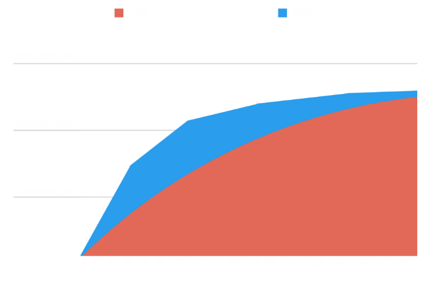

# Raptoreum reward structure

<a
  class="button button--sm button--primary button--download"
  href="/public/whitepapers/Raptoreum_Rewards_Structure_Whitepaper"
  target="_parent"
  download
>
  Download Emissions & Rewards paper
</a>

In order to make the emission of RTM smooth and unique, reduction is every 21,262 blocks which is 29 days 12 hours and 44 minutes. By slowly decreasing the block reward every full moon (for which an owling is a cool name), we ensure a smooth emission of RTM in comparison with other major coins such as BTC or RVN (which share the same basic structure).

## Phases

Each phase is 8 years (2 regular 4 years halving), which corresponds to almost exactly 99 lunar months. For fun, that cycle is called an [octaeteris](https://en.wikipedia.org/wiki/Octaeteris).

### Phase 1

Phase 1 has 26 lunar months, which will hold a 5000 RTM block reward, during which the collateral is adjusted as shown in the [Litepaper](./litepaper.md), after which there are 73 lunar months with a 10 RTM block reward reduction every full moon.

### Phase 2

Phase 2 has 99 lunar months with a 20 RTM block reward reduction every full moon.

### Phase 3

Phase 3 has 50 lunar months with a 20 RTM block reward reduction every full moon.  
This is followed by 49 months with a 10 RTM block reward reduction every full moon.

## Emission curve

That is the first 24 years of Raptoreum (RTM) emissions.

After the first 24 years (or 6,314,814 blocks), 20,223,989,880 Raptoreum (RTM) will be in circulation (96.3% of total suply), a number very close to the 20,674,189,687 Ravencoin (RVN) intended to be released during the same 24 year period (98.44% of Total RVN supply). However, emissions of Raptoreum (RTM) will have been issued in a much smoother way.

Find below a graph showing the first 24 years emissions of both Raptoreum (RTM) and Ravencoin (RVN). Note the more distinctly identifiable halvings for Ravencoin (RVN).

## Next halving

You can find below a detailed table of the first 297 lunar months (24 years)
of RTM emissions

First 720 is 4 so first lunar month is less then month reward in this calculation

| Month | Block Height | Block Reward | Monthly Reward | Circulating Supply |
|-------|-------------|-------------|-------------|-------------------|
| 1     | 21262       | 5000        | 106310000   | 102,712,880.00    |
| 2     | 42524       | 5000        | 106310000   | 209,022,880.00    |
| 3     | 63786       | 5000        | 106310000   | 315,332,880.00    |
| 4     | 85048       | 5000        | 106310000   | 421,642,880.00    |
| 5     | 106310      | 5000        | 106310000   | 527,952,880.00    |
| 6     | 127572      | 5000        | 106310000   | 634,262,880.00    |
| 7     | 148834      | 5000        | 106310000   | 740,572,880.00    |
| 8     | 170096      | 5000        | 106310000   | 846,882,880.00    |
| 9     | 191358      | 5000        | 106310000   | 953,192,880.00    |
| 10    | 212620      | 5000        | 106310000   | 1,059,502,880.00  |
| 11    | 233882      | 5000        | 106310000   | 1,165,812,880.00  |
| 12    | 255144      | 5000        | 106310000   | 1,272,122,880.00  |
| 13    | 276406      | 5000        | 106310000   | 1,378,432,880.00  |
| 14    | 297668      | 5000        | 106310000   | 1,484,742,880.00  |
| 15    | 318930      | 5000        | 106310000   | 1,591,052,880.00  |
| 16    | 340192      | 5000        | 106310000   | 1,697,362,880.00  |
| 17    | 361454      | 5000        | 106310000   | 1,803,672,880.00  |
| 18    | 382716      | 5000        | 106310000   | 1,909,982,880.00  |
| 19    | 403978      | 5000        | 106310000   | 2,016,292,880.00  |
| 20    | 425240      | 5000        | 106310000   | 2,122,602,880.00  |
| 21    | 446502      | 5000        | 106310000   | 2,228,912,880.00  |
| 22    | 467764      | 5000        | 106310000   | 2,335,222,880.00  |
| 23    | 489026      | 5000        | 106310000   | 2,441,532,880.00  |
| 24    | 510288      | 5000        | 106310000   | 2,547,842,880.00  |
| 25    | 531550      | 5000        | 106310000   | 2,654,152,880.00  |
| 26    | 552812      | 5000        | 106310000   | 2,760,462,880.00  |
| 27    | 574074      | 4990        | 106097380   | 2,866,560,260.00  |
| 28    | 595336      | 4980        | 105884760   | 2,972,445,020.00  |
| 29    | 616598      | 4970        | 105672140   | 3,078,117,160.00  |
| 30    | 637860      | 4960        | 105459520   | 3,183,576,680.00  |
| 31    | 659122      | 4950        | 105246900   | 3,288,823,580.00  |
| 32    | 680384      | 4940        | 105034280   | 3,393,857,860.00  |
| 33    | 701646      | 4930        | 104821660   | 3,498,679,520.00  |
| 34    | 722908      | 4920        | 104609040   | 3,603,288,560.00  |
| 35    | 744170      | 4910        | 104396420   | 3,707,684,980.00  |
| 36    | 765432      | 4900        | 104183800   | 3,811,868,780.00  |
| 37    | 786694      | 4890        | 103971180   | 3,915,839,960.00  |
| 38    | 807956      | 4880        | 103758560   | 4,019,598,520.00  |
| 39    | 829218      | 4870        | 103545940   | 4,123,144,460.00  |
| 40    | 850480      | 4860        | 103333320   | 4,226,477,780.00  |
| 41    | 871742      | 4850        | 103120700   | 4,329,598,480.00  |
| 42    | 893004      | 4840        | 102908080   | 4,432,506,560.00  |
| 43    | 914266      | 4830        | 102695460   | 4,535,202,020.00  |
| 44    | 935528      | 4820        | 102482840   | 4,637,684,860.00  |
| 45    | 956790      | 4810        | 102270220   | 4,739,955,080.00  |
| 46    | 978052      | 4800        | 102057600   | 4,842,012,680.00  |
| 47    | 999314      | 4790        | 101844980   | 4,943,857,660.00  |
| 48    | 1020576     | 4780        | 101632360   | 5,045,490,020.00  |
| 49    | 1041838     | 4770        | 101419740   | 5,146,909,760.00  |
| 50    | 1063100     | 4760        | 101207120   | 5,248,116,880.00  |
| 51    | 1084362     | 4750        | 100994500   | 5,349,111,380.00  |
| 52    | 1105624     | 4740        | 100781880   | 5,449,893,260.00  |
| 53    | 1126886     | 4730        | 100569260   | 5,550,462,520.00  |
| 54    | 1148148     | 4720        | 100356640   | 5,650,819,160.00  |
| 55    | 1169410     | 4710        | 100144020   | 5,750,963,180.00  |
| 56    | 1190672     | 4700        | 99931400    | 5,850,894,580.00  |
| 57    | 1211934     | 4690        | 99718780    | 5,950,613,360.00  |
| 58    | 1233196     | 4680        | 99506160    | 6,050,119,520.00  |
| 59    | 1254458     | 4670        | 99293540    | 6,149,413,060.00  |
| 60    | 1275720     | 4660        | 99080920    | 6,248,493,980.00  |
| 61    | 1296982     | 4650        | 98868300    | 6,347,362,280.00  |
| 62    | 1318244     | 4640        | 98655680    | 6,446,017,960.00  |
| 63    | 1339506     | 4630        | 98443060    | 6,544,461,020.00  |
| 64    | 1360768     | 4620        | 98230440    | 6,642,691,460.00  |
| 65    | 1382030     | 4610        | 98017820    | 6,740,709,280.00  |
| 66    | 1403292     | 4600        | 97805200    | 6,838,514,480.00  |
| 67    | 1424554     | 4590        | 97592580    | 6,936,107,060.00  |
| 68    | 1445816     | 4580        | 97379960    | 7,033,487,020.00  |
| 69    | 1467078     | 4570        | 97167340    | 7,130,654,360.00  |
| 70    | 1488340     | 4560        | 96954720    | 7,227,609,080.00  |
| 71    | 1509602     | 4550        | 96742100    | 7,324,351,180.00  |
| 72    | 1530864     | 4540        | 96529480    | 7,420,880,660.00  |
| 73    | 1552126     | 4530        | 96316860    | 7,517,197,520.00  |
| 74    | 1573388     | 4520        | 96104240    | 7,613,301,760.00  |
| 75    | 1594650     | 4510        | 95891620    | 7,709,193,380.00  |
| 76    | 1615912     | 4500        | 95679000    | 7,804,872,380.00  |
| 77    | 1637174     | 4490        | 95466380    | 7,900,338,760.00  |
| 78    | 1658436     | 4480        | 95253760    | 7,995,592,520.00  |
| 79    | 1679698     | 4470        | 95041140    | 8,090,633,660.00  |
| 80    | 1700960     | 4460        | 94828520    | 8,185,462,180.00  |
| 81    | 1722222     | 4450        | 94615900    | 8,280,078,080.00  |
| 82    | 1743484     | 4440        | 94403280    | 8,374,481,360.00  |
| 83    | 1764746     | 4430        | 94190660    | 8,468,672,020.00  |
| 84    | 1786008     | 4420        | 93978040    | 8,562,650,060.00  |
| 85    | 1807270     | 4410        | 93765420    | 8,656,415,480.00  |
| 86    | 1828532     | 4400        | 93552800    | 8,749,968,280.00  |
| 87    | 1849794     | 4390        | 93340180    | 8,843,308,460.00  |
| 88    | 1871056     | 4380        | 93127560    | 8,936,436,020.00  |
| 89    | 1892318     | 4370        | 92914940    | 9,029,350,960.00  |
| 90    | 1913580     | 4360        | 92702320    | 9,122,053,280.00  |
| 91    | 1934842     | 4350        | 92489700    | 9,214,542,980.00  |
| 92    | 1956104     | 4340        | 92277080    | 9,306,820,060.00  |
| 93    | 1977366     | 4330        | 92064460    | 9,398,884,520.00  |
| 94    | 1998628     | 4320        | 91851840    | 9,490,736,360.00  |
| 95    | 2019890     | 4310        | 91639220    | 9,582,375,580.00  |
| 96    | 2041152     | 4300        | 91426600    | 9,673,802,180.00  |
| 97    | 2062414     | 4290        | 91213980    | 9,765,016,160.00  |
| 98    | 2083676     | 4280        | 91001360    | 9,856,017,520.00  |
| 99    | 2104938     | 4270        | 90788740    | 9,946,806,260.00  |
| 100   | 2126200     | 4250        | 90363500    | 10,037,169,760.00 |
| 101   | 2147462     | 4230        | 89938260    | 10,127,108,020.00 |
| 102   | 2168724     | 4210        | 89513020    | 10,216,621,040.00 |
| 103   | 2189986     | 4190        | 89087780    | 10,305,708,820.00 |
| 104   | 2211248     | 4170        | 88662540    | 10,394,371,360.00 |
| 105   | 2232510     | 4150        | 88237300    | 10,482,608,660.00 |
| 106   | 2253772     | 4130        | 87812060    | 10,570,420,720.00 |
| 107   | 2275034     | 4110        | 87386820    | 10,657,807,540.00 |
| 108   | 2296296     | 4090        | 86961580    | 10,744,769,120.00 |
| 109   | 2317558     | 4070        | 86536340    | 10,831,305,460.00 |
| 110   | 2338820     | 4050        | 86111100    | 10,917,416,560.00 |
| 111   | 2360082     | 4030        | 85685860    | 11,003,102,420.00 |
| 112   | 2381344     | 4010        | 85260620    | 11,088,363,040.00 |
| 113   | 2402606     | 3990        | 84835380    | 11,173,198,420.00 |
| 114   | 2423868     | 3970        | 84410140    | 11,257,608,560.00 |
| 115   | 2445130     | 3950        | 83984900    | 11,341,593,460.00 |
| 116   | 2466392     | 3930        | 83559660    | 11,425,153,120.00 |
| 117   | 2487654     | 3910        | 83134420    | 11,508,287,540.00 |
| 118   | 2508916     | 3890        | 82709180    | 11,590,996,720.00 |
| 119   | 2530178     | 3870        | 82283940    | 11,673,280,660.00 |
| 120   | 2551440     | 3850        | 81858700    | 11,755,139,360.00 |
| 121   | 2572702     | 3830        | 81433460    | 11,836,572,820.00 |
| 122   | 2593964     | 3810        | 81008220    | 11,917,581,040.00 |
| 123   | 2615226     | 3790        | 80582980    | 11,998,164,020.00 |
| 124   | 2636488     | 3770        | 80157740    | 12,078,321,760.00 |
| 125   | 2657750     | 3750        | 79732500    | 12,158,054,260.00 |
| 126   | 2679012     | 3730        | 79307260    | 12,237,361,520.00 |
| 127   | 2700274     | 3710        | 78882020    | 12,316,243,540.00 |
| 128   | 2721536     | 3690        | 78456780    | 12,394,700,320.00 |
| 129   | 2742798     | 3670        | 78031540    | 12,472,731,860.00 |
| 130   | 2764060     | 3650        | 77606300    | 12,550,338,160.00 |
| 131   | 2785322     | 3630        | 77181060    | 12,627,519,220.00 |
| 132   | 2806584     | 3610        | 76755820    | 12,704,275,040.00 |
| 133   | 2827846     | 3590        | 76330580    | 12,780,605,620.00 |
| 134   | 2849108     | 3570        | 75905340    | 12,856,510,960.00 |
| 135   | 2870370     | 3550        | 75480100    | 12,931,991,060.00 |
| 136   | 2891632     | 3530        | 75054860    | 13,007,045,920.00 |
| 137   | 2912894     | 3510        | 74629620    | 13,081,675,540.00 |
| 138   | 2934156     | 3490        | 74204380    | 13,155,879,920.00 |
| 139   | 2955418     | 3470        | 73779140    | 13,229,659,060.00 |
| 140   | 2976680     | 3450        | 73353900    | 13,303,012,960.00 |
| 141   | 2997942     | 3430        | 72928660    | 13,375,941,620.00 |
| 142   | 3019204     | 3410        | 72503420    | 13,448,445,040.00 |
| 143   | 3040466     | 3390        | 72078180    | 13,520,523,220.00 |
| 144   | 3061728     | 3370        | 71652940    | 13,592,176,160.00 |
| 145   | 3082990     | 3350        | 71227700    | 13,663,403,860.00 |
| 146   | 3104252     | 3330        | 70802460    | 13,734,206,320.00 |
| 147   | 3125514     | 3310        | 70377220    | 13,804,583,540.00 |
| 148   | 3146776     | 3290        | 69951980    | 13,874,535,520.00 |
| 149   | 3168038     | 3270        | 69526740    | 13,944,062,260.00 |
| 150   | 3189300     | 3250        | 69101500    | 14,013,163,760.00 |
| 151   | 3210562     | 3230        | 68676260    | 14,081,840,020.00 |
| 152   | 3231824     | 3210        | 68251020    | 14,150,091,040.00 |
| 153   | 3253086     | 3190        | 67825780    | 14,217,916,820.00 |
| 154   | 3274348     | 3170        | 67400540    | 14,285,317,360.00 |
| 155   | 3295610     | 3150        | 66975300    | 14,352,292,660.00 |
| 156   | 3316872     | 3130        | 66550060    | 14,418,842,720.00 |
| 157   | 3338134     | 3110        | 66124820    | 14,484,967,540.00 |
| 158   | 3359396     | 3090        | 65699580    | 14,550,667,120.00 |
| 159   | 3380658     | 3070        | 65274340    | 14,615,941,460.00 |
| 160   | 3401920     | 3050        | 64849100    | 14,680,790,560.00 |
| 161   | 3423182     | 3030        | 64423860    | 14,745,214,420.00 |
| 162   | 3444444     | 3010        | 63998620    | 14,809,213,040.00 |
| 163   | 3465706     | 2990        | 63573380    | 14,872,786,420.00 |
| 164   | 3486968     | 2970        | 63148140    | 14,935,934,560.00 |
| 165   | 3508230     | 2950        | 62722900    | 14,998,657,460.00 |
| 166   | 3529492     | 2930        | 62297660    | 15,060,955,120.00 |
| 167   | 3550754     | 2910        | 61872420    | 15,122,827,540.00 |
| 168   | 3572016     | 2890        | 61447180    | 15,184,274,720.00 |
| 169   | 3593278     | 2870        | 61021940    | 15,245,296,660.00 |
| 170   | 3614540     | 2850        | 60596700    | 15,305,893,360.00 |
| 171   | 3635802     | 2830        | 60171460    | 15,366,064,820.00 |
| 172   | 3657064     | 2810        | 59746220    | 15,425,811,040.00 |
| 173   | 3678326     | 2790        | 59320980    | 15,485,132,020.00 |
| 174   | 3699588     | 2770        | 58895740    | 15,544,027,760.00 |
| 175   | 3720850     | 2750        | 58470500    | 15,602,498,260.00 |
| 176   | 3742112     | 2730        | 58045260    | 15,660,543,520.00 |
| 177   | 3763374     | 2710        | 57620020    | 15,718,163,540.00 |
| 178   | 3784636     | 2690        | 57194780    | 15,775,358,320.00 |
| 179   | 3805898     | 2670        | 56769540    | 15,832,127,860.00 |
| 180   | 3827160     | 2650        | 56344300    | 15,888,472,160.00 |
| 181   | 3848422     | 2630        | 55919060    | 15,944,391,220.00 |
| 182   | 3869684     | 2610        | 55493820    | 15,999,885,040.00 |
| 183   | 3890946     | 2590        | 55068580    | 16,054,953,620.00 |
| 184   | 3912208     | 2570        | 54643340    | 16,109,596,960.00 |
| 185   | 3933470     | 2550        | 54218100    | 16,163,815,060.00 |
| 186   | 3954732     | 2530        | 53792860    | 16,217,607,920.00 |
| 187   | 3975994     | 2510        | 53367620    | 16,270,975,540.00 |
| 188   | 3997256     | 2490        | 52942380    | 16,323,917,920.00 |
| 189   | 4018518     | 2470        | 52517140    | 16,376,435,060.00 |
| 190   | 4039780     | 2450        | 52091900    | 16,428,526,960.00 |
| 191   | 4061042     | 2430        | 51666660    | 16,480,193,620.00 |
| 192   | 4082304     | 2410        | 51241420    | 16,531,435,040.00 |
| 193   | 4103566     | 2390        | 50816180    | 16,582,251,220.00 |
| 194   | 4124828     | 2370        | 50390940    | 16,632,642,160.00 |
| 195   | 4146090     | 2350        | 49965700    | 16,682,607,860.00 |
| 196   | 4167352     | 2330        | 49540460    | 16,732,148,320.00 |
| 197   | 4188614     | 2310        | 49115220    | 16,781,263,540.00 |
| 198   | 4209876     | 2290        | 48689980    | 16,829,953,520.00 |
| 199   | 4231138     | 2270        | 48264740    | 16,878,218,260.00 |
| 200   | 4252400     | 2250        | 47839500    | 16,926,057,760.00 |
| 201   | 4273662     | 2230        | 47414260    | 16,973,472,020.00 |
| 202   | 4294924     | 2210        | 46989020    | 17,020,461,040.00 |
| 203   | 4316186     | 2190        | 46563780    | 17,067,024,820.00 |
| 204   | 4337448     | 2170        | 46138540    | 17,113,163,360.00 |
| 205   | 4358710     | 2150        | 45713300    | 17,158,876,660.00 |
| 206   | 4379972     | 2130        | 45288060    | 17,204,164,720.00 |
| 207   | 4401234     | 2110        | 44862820    | 17,249,027,540.00 |
| 208   | 4422496     | 2090        | 44437580    | 17,293,465,120.00 |
| 209   | 4443758     | 2070        | 44012340    | 17,337,477,460.00 |
| 210   | 4465020     | 2050        | 43587100    | 17,381,064,560.00 |
| 211   | 4486282     | 2030        | 43161860    | 17,424,226,420.00 |
| 212   | 4507544     | 2010        | 42736620    | 17,466,963,040.00 |
| 213   | 4528806     | 1990        | 42311380    | 17,509,274,420.00 |
