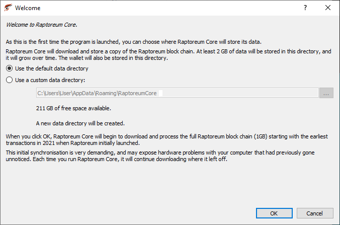
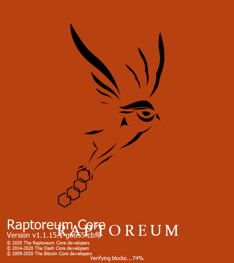

# Installation

Visit: <https://github.com/Raptor3um/raptoreum/releases>

1. Download the latest wallet release for windows
2. Extract the .zip file or locate the .exe file
3. Run: `raptoreum-qt.exe`
4. Choose a data path to install the wallet or use the default path

    

5. The wallet will startup and begin to Sync

