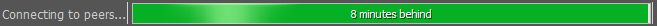
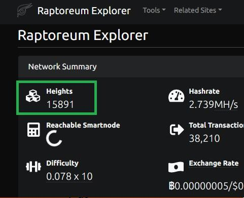
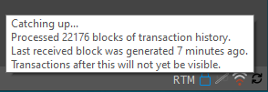
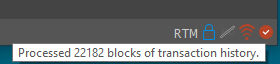

# Syncing

:::info Syncing

If this is the first time running the RTM wallet,it may take several minutes to an hour to sync. Sync status will appear in the bottom left of the window.

:::

:::note

The wallet must sync fully to the current network block height before you can see your current balance or send funds from it! You can always check the network's current block height at: __<https://explorer.raptoreum.com/>__

:::

You will see the status if you hover your mouse icon over the the bottom right corner of the wallet:

When fully synced, you will see:

